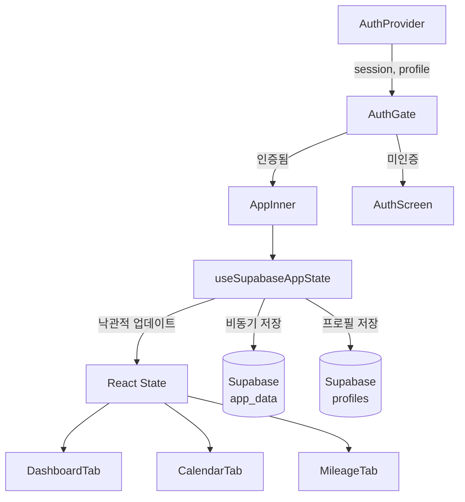
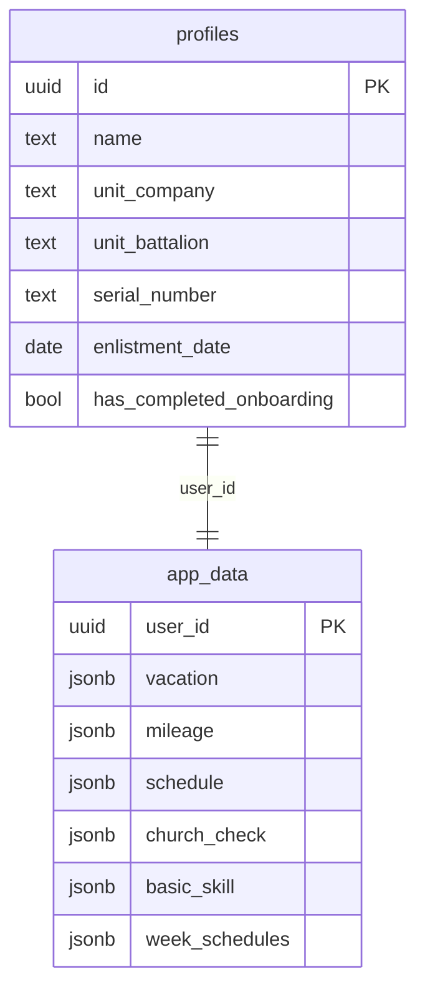

# 군생활 관리 앱 — 155대대

대한민국 육군 155대대 병사를 위한 스마트 군 생활 관리 Progressive Web App.

---

## 기능 개요

| 기능 | 설명 |
|---|---|
| 복무 현황 | 입대일 기반 전역일·복무율·남은 일수 실시간 계산 |
| 마일리지 | 획득/차감 기록, 잔여 시간 조회 |
| 휴가 관리 | 연가·포상·위로·청원 휴가 잔여일 추적, 포상휴가 자동 만료 |
| 일정 캘린더 | 외출·외박·근무·당직 등 11종 이벤트 캘린더 |
| 병기본 & 진급 | 체력·수영·사격 성적 기록, 진급 일정 자동 계산, 출타통제 여부 판단 |
| 교회 출석 | 수요예배·주일예배 출석 기록 및 마일리지 자동 지급 |

---

## 아키텍처 개요

```
src/
├── components/          # UI 컴포넌트 (기능별 디렉토리 분리)
│   ├── auth/            # 로그인·회원가입
│   ├── calendar/        # 캘린더 및 이벤트 모달
│   ├── dashboard/       # 대시보드 카드들
│   ├── layout/          # Header, BottomNav, InstallBanner
│   ├── mileage/         # 마일리지·휴가·병기본
│   ├── modals/          # 온보딩, 설정, 교회 출석
│   └── shared/          # Modal, ProgressBar (공용)
├── constants/           # 초기값, 이벤트 스타일, 공휴일 목록
├── context/             # AuthContext (Supabase 세션 관리)
├── hooks/               # 커스텀 훅 (상태 로직 분리)
├── lib/                 # Supabase 클라이언트 싱글턴
├── logic/               # 순수 비즈니스 로직 (UI 독립)
├── types/               # TypeScript 타입 정의
└── utils/               # 날짜·마일리지 유틸리티
```

### 상태 관리 흐름 (Mermaid)



### 데이터베이스 스키마 (Mermaid)



---

## 기술 스택

- **Frontend**: React 18 + TypeScript (strict mode)
- **Styling**: Tailwind CSS
- **Icons**: Lucide React
- **날짜 처리**: date-fns
- **Backend**: Supabase (Auth + PostgreSQL + RLS)
- **빌드**: Vite

---

## PWA 설치 및 서비스 워커

### 설치 방법

앱에 접속 시 상단에 **"홈 화면에 추가"** 배너가 나타납니다.
- **Android Chrome**: 배너의 "설치" 버튼 클릭
- **iOS Safari**: 공유 버튼 → "홈 화면에 추가"
- **Desktop Chrome**: 주소창 우측 설치 아이콘 클릭

### 서비스 워커 캐싱 전략

| 요청 유형 | 전략 |
|---|---|
| HTML 문서 | Network First (오프라인 시 캐시 폴백) |
| JS/CSS 정적 자산 | Cache First (빠른 로딩) |
| Supabase API | 캐시 없음 (항상 네트워크) |

서비스 워커 파일: `public/sw.js`
매니페스트 파일: `public/manifest.json`

---

## 로컬 개발 환경 설정

### 1. 저장소 클론 및 의존성 설치

```bash
git clone <repo-url>
cd project
npm install
```

### 2. 환경 변수 설정

`.env` 파일을 생성하고 아래 값을 입력합니다:

```env
VITE_SUPABASE_URL=https://your-project.supabase.co
VITE_SUPABASE_ANON_KEY=your-anon-key
```

### 3. Supabase 데이터베이스 마이그레이션

Supabase 대시보드 SQL 에디터에서 아래 테이블을 생성합니다:

```sql
-- profiles 테이블 (auth.users와 연동)
create table profiles (
  id uuid primary key references auth.users(id) on delete cascade,
  name text not null,
  unit_company text not null,
  unit_battalion text not null,
  serial_number text not null unique,
  enlistment_date date,
  has_completed_onboarding boolean default false
);

-- app_data 테이블 (사용자 데이터 JSON 저장)
create table app_data (
  user_id uuid primary key references auth.users(id) on delete cascade,
  vacation jsonb default '{}',
  mileage jsonb default '{}',
  schedule jsonb default '{}',
  church_check jsonb default '{}',
  basic_skill jsonb default '{}',
  week_schedules jsonb default '{}'
);

-- RLS 활성화
alter table profiles enable row level security;
alter table app_data enable row level security;

-- 정책: 본인 데이터만 접근 허용
create policy "Users can view own profile" on profiles for select to authenticated using (auth.uid() = id);
create policy "Users can update own profile" on profiles for update to authenticated using (auth.uid() = id) with check (auth.uid() = id);
create policy "Users can view own app_data" on app_data for select to authenticated using (auth.uid() = user_id);
create policy "Users can update own app_data" on app_data for update to authenticated using (auth.uid() = user_id) with check (auth.uid() = user_id);
```

### 4. 개발 서버 실행

```bash
npm run dev
```

---

## 배포

### Vite 빌드

```bash
npm run build
```

빌드 결과물은 `dist/` 디렉토리에 생성됩니다. 정적 파일 호스팅 서비스(Vercel, Netlify 등)에 배포할 수 있습니다.

### Vercel 배포 예시

```bash
npx vercel --prod
```

환경 변수는 Vercel 대시보드 → Settings → Environment Variables에서 추가합니다.

---

## 보안 사항

- 모든 데이터베이스 테이블에 RLS(Row Level Security) 적용
- Supabase 환경 변수 누락 시 앱 실행 차단 (fail-fast)
- `onAuthStateChange` 비동기 deadlock 방지 패턴 적용
- 서비스 워커는 Supabase API 요청을 캐시하지 않음

---

## 타입 안전성

TypeScript `strict` 모드 활성화, `any` 타입 제로 정책 준수:
- `deepMerge` 함수: `unknown` 타입으로 안전한 파싱
- `VacationData.rewardVacation.usedDays`: 명시적 타입 정의
- 마이그레이션 코드: 교차 타입(`& { total?: number }`)으로 구버전 데이터 안전 처리
